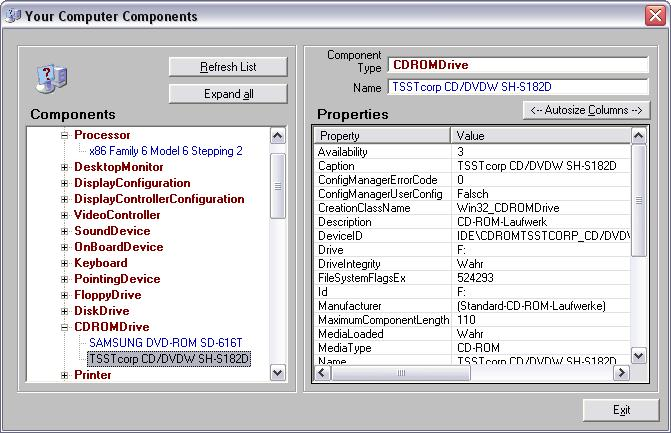



## Your Computer Components

### Description

This little utility lists most of the components of your computer, together with their properties. In fact it tells you everything Windows knows about your hardware and associated drivers. Tested with WinXP only. Download is 11 kB.
 
### More Info
 

             |
---                |---
**Submitted On**   |2007-02-11 11:12:52
**By**             |[ULLI](https://github.com/Planet-Source-Code/PSCIndex/blob/master/ByAuthor/ulli.md)
**Level**          |Advanced
**User Rating**    |5.0 (95 globes from 19 users)
**Compatibility**  |VB 6\.0
**Category**       |[Miscellaneous](https://github.com/Planet-Source-Code/PSCIndex/blob/master/ByCategory/miscellaneous__1-1.md)
**World**          |[Visual Basic](https://github.com/Planet-Source-Code/PSCIndex/blob/master/ByWorld/visual-basic.md)
**Archive File**   |[Your\_Compu2047662132007\.zip](https://github.com/Planet-Source-Code/ulli-your-computer-components__1-67841/archive/master.zip)

### API Declarations

WMI - Windows Management Instrumentation.

